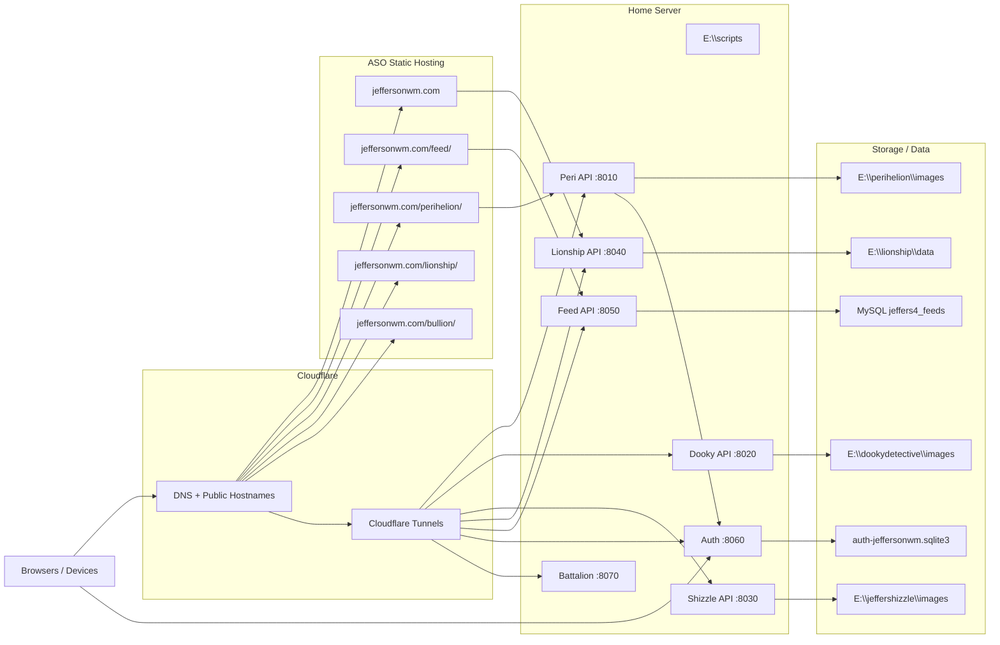
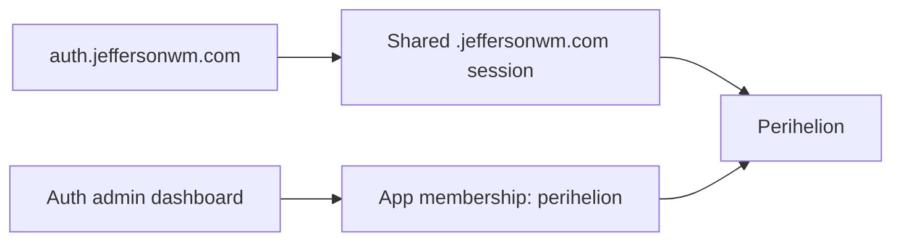
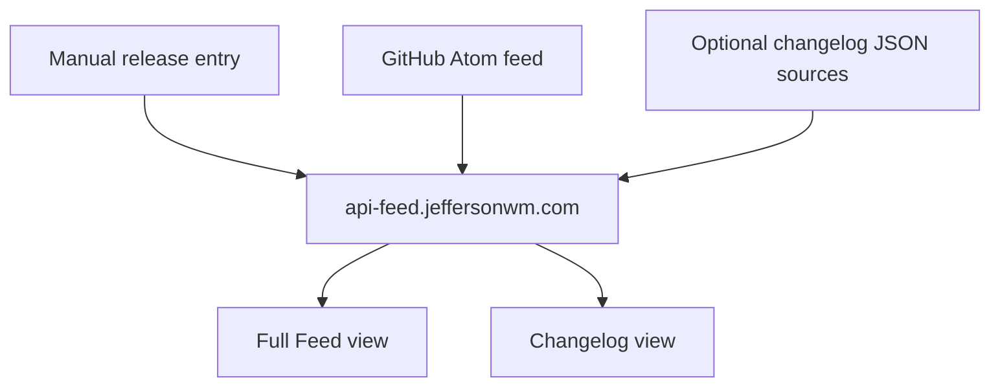

# JeffersonWM Network Infographic

This is the high-signal map of the current JeffersonWM network.

Use it as:

- an operations reference
- a handoff for other chats and apps
- a source of truth for where each site lives, what it talks to, and how it starts

---

## Network Map



---

## Device Roles

### Laptop / local source machine

- primary code source
- local repos and builds
- Git commits and pushes
- ASO frontend upload source

Main local repo roots:

- `C:\Users\wmjef\Desktop\Precious Box\Dotcoms\jeffersonwm`
- `C:\Users\wmjef\Desktop\Precious Box\Dotcoms\auth-jeffersonwm`
- `C:\Users\wmjef\Desktop\Precious Box\Dotcoms\dookydetective`
- `C:\Users\wmjef\Desktop\Precious Box\Dotcoms\jeffershizzle`
- `C:\Users\wmjef\Desktop\Precious Box\Dotcoms\multimillion`

### Home server

- live backend runtimes
- live Python and Node processes
- tunnel entry point origin
- local image/data stores

### ASO

- static frontend hosting
- JeffersonWM homepage
- Feed frontend
- Perihelion frontend
- Lionship frontend
- Bullion frontend

### Cloudflare

- public DNS
- public hostname exposure
- tunnel routing from hostnames to server origins

---

## Entity Matrix

| Entity | Public frontend | Public API | Local source | Live runtime | Port | Notes |
|---|---|---|---|---|---|---|
| JeffersonWM | `https://jeffersonwm.com` | widget data via Lionship | `apps/jeffersonwm` | ASO root | n/a | homepage hub |
| Feed | `https://jeffersonwm.com/feed/` | `https://api-feed.jeffersonwm.com` | `apps/feed` | `E:\feed\backend` | `8050` | GitHub + release timeline |
| Bullion | `https://jeffersonwm.com/bullion/` | none | `apps/bullion` | ASO only | n/a | frontend-only |
| Perihelion | `https://jeffersonwm.com/perihelion/` | `https://api.jeffersonwm.com` | `apps/perihelion` | `E:\scripts\perihelion_images_api.py` | `8010` | central-auth protected |
| Lionship | `https://jeffersonwm.com/lionship/` | `https://api-lionship.jeffersonwm.com` | `apps/lionship` | `E:\lionship\backend` | `8040` | widgets + links |
| Dooky Detective | `https://dookydetective.com` | `https://api.dookydetective.com` | separate repo | `E:\dookydetective\backend` | `8020` | home-server images |
| Jeffershizzle | `https://jeffershizzle.com` | `https://api.jeffershizzle.com` | separate repo | `E:\scripts\jeffershizzle_images_api.py` | `8030` | archive API |
| Auth JeffersonWM | `https://auth.jeffersonwm.com` | same host | separate repo | `E:\auth-jeffersonwm\backend` | `8060` | shared account system |
| Battalion | `https://jeffersonwm.com/battalion/` | tunnel-backed runtime | `apps/battalion` + home server runtime | `E:\battalion` | `8070` | `npm run prod` |
| Vermilion | local app | none | `apps/vermilion` | local only | n/a | Python desktop organizer |

---

## Current Version Labels

These are the public-facing version markers currently in use or implied by the current rollout:

- JeffersonWM: `v1.0.0`
- Feed: `v0.1`
- Bullion: `v0.1`
- Lionship: `v0.1`
- Perihelion: `v0.3` on homepage, package currently `1.0.0`
- Dooky Detective: `v0.2`
- Jeffershizzle: `v0.2`
- Auth JeffersonWM: `v0.1.0`
- Battalion: `v1.0.0` in server package
- Vermilion: baseline `v0.1.0`

---

## Public Hostnames And Origins

| Hostname | Origin type | Origin target |
|---|---|---|
| `jeffersonwm.com` | ASO static | JeffersonWM root |
| `jeffersonwm.com/feed/` | ASO static | `/feed/` subfolder |
| `jeffersonwm.com/bullion/` | ASO static | `/bullion/` subfolder |
| `jeffersonwm.com/perihelion/` | ASO static | `/perihelion/` subfolder |
| `jeffersonwm.com/lionship/` | ASO static | `/lionship/` subfolder |
| `auth.jeffersonwm.com` | tunnel | `http://127.0.0.1:8060` |
| `api-feed.jeffersonwm.com` | tunnel | `http://127.0.0.1:8050` |
| `api.jeffersonwm.com` | tunnel | `http://127.0.0.1:8010` |
| `api-lionship.jeffersonwm.com` | tunnel | `http://127.0.0.1:8040` |
| `api.dookydetective.com` | tunnel | `http://127.0.0.1:8020` |
| `api.jeffershizzle.com` | tunnel | `http://127.0.0.1:8030` |
| `api-battalion...` | tunnel | `http://127.0.0.1:8070` |

Important tunnel rule reminder:

- local origins should be `HTTP` unless the app itself truly serves local HTTPS

---

## Service Commands

### Perihelion backend

```powershell
Set-Location E:\scripts
$env:PERIHELION_REQUIRE_AUTH='true'
$env:PERIHELION_AUTH_PROVIDER='central'
$env:PERIHELION_AUTH_BASE_URL='https://auth.jeffersonwm.com'
$env:PERIHELION_CENTRAL_AUTH_DB_PATH='E:\auth-jeffersonwm\backend\data\auth-jeffersonwm.sqlite3'
$env:PERIHELION_CENTRAL_SESSION_COOKIE_NAME='auth_jeffersonwm_session'
$env:PERIHELION_REQUIRED_APP_MEMBERSHIP='perihelion'
python E:\scripts\perihelion_images_api.py
```

### Peri tunnel

```powershell
cloudflared tunnel run --token-file C:\Users\Bill\.cloudflared\tokens\api-perihelion.token
```

### Dooky backend

```powershell
Set-Location E:\dookydetective\backend
npm run server
```

### Dooky tunnel

```powershell
cloudflared tunnel run --token-file C:\Users\Bill\.cloudflared\tokens\api-dookydetective.token
```

### Jeffershizzle backend

```powershell
Set-Location E:\scripts
py E:\scripts\jeffershizzle_images_api.py
```

### Jeffershizzle tunnel

```powershell
cloudflared.exe tunnel run --token-file C:\Users\Bill\.cloudflared\tokens\api-jeffershizzle.token
```

### Lionship backend

```powershell
Set-Location E:\lionship\backend
npm run server
```

### Lionship tunnel

```powershell
cloudflared tunnel run --token-file C:\Users\Bill\.cloudflared\tokens\api-lionship.token
```

### Feed backend

```powershell
Set-Location E:\feed\backend
$env:NODE_ENV='production'
npm run server
```

### Feed tunnel

```powershell
cloudflared.exe tunnel run --token-file C:\Users\Bill\.cloudflared\tokens\api-feed.token
```

### Auth backend

```powershell
Set-Location E:\auth-jeffersonwm\backend
$env:NODE_ENV='production'
npm run server
```

### Auth tunnel

```powershell
cloudflared.exe tunnel run --token-file C:\Users\Bill\.cloudflared\tokens\api-auth-jeffersonwm.token
```

### Battalion backend

```powershell
Set-Location E:\battalion
npm run prod
```

### Battalion tunnel

```powershell
cloudflared.exe tunnel run --token-file C:\Users\Bill\.cloudflared\tokens\api-battalion.token
```

---

## VS Code Operations

Shared workspace:

- `\\JEFFERSHIZZLE-D\Dotcoms\scripts\dotcoms-code-workspace.code-workspace`

Shared task files:

- `\\JEFFERSHIZZLE-D\Dotcoms\scripts\.vscode\tasks.json`
- `\\JEFFERSHIZZLE-D\Dotcoms\scripts\service-launcher.ps1`

Main task commands:

- `VSCode: start all services`
- `VSCode: restart all services`
- `VSCode: stop all services`

Useful subsets:

- `start tunnels only`
- `start servers only`
- `restart tunnels`
- `restart servers`

Direct scripts from `E:\scripts`:

```powershell
.\start-all-services.ps1
.\stop-all-services.ps1
.\restart-all-services.ps1
.\start-servers.ps1
.\start-tunnels.ps1
.\restart-servers.ps1
.\restart-tunnels.ps1
```

---

## Frontend Build And Upload Commands

From:

- `C:\Users\wmjef\Desktop\Precious Box\Dotcoms\jeffersonwm`

Build individual apps:

```powershell
npm run build:jeffersonwm
npm run build:feed
npm run build:perihelion
npm run build:lionship
npm run build:bullion
```

Build all monorepo frontends:

```powershell
npm run build
```

Upload targets:

- `apps/jeffersonwm/dist` -> JeffersonWM root on ASO
- `apps/feed/dist` -> `/feed/` on ASO
- `apps/perihelion/dist` -> `/perihelion/` on ASO
- `apps/lionship/dist` -> `/lionship/` on ASO
- `apps/bullion/dist` -> `/bullion/` on ASO

Rule:

- upload the contents of `dist`, not the `dist` folder itself

---

## Auth Relationship



Auth facts:

- repo:
  - `C:\Users\wmjef\Desktop\Precious Box\Dotcoms\auth-jeffersonwm`
- runtime:
  - `E:\auth-jeffersonwm\backend`
- storage:
  - `E:\auth-jeffersonwm\backend\data\auth-jeffersonwm.sqlite3`
- cookie domain:
  - `.jeffersonwm.com`

Peri access requires:

- approved user
- `perihelion` app membership

---

## Feed / Changelog Relationship



Feed facts:

- frontend:
  - `https://jeffersonwm.com/feed/`
- API:
  - `https://api-feed.jeffersonwm.com`
- runtime:
  - `E:\feed\backend`
- data:
  - MySQL `jeffers4_feeds`
- editor secret:
  - `FEED_SECRET` in `E:\feed\backend\.env`

Release entries:

- `source: "release"`
- mixed into full feed chronologically
- also visible in changelog-only view

---

## Key Files

JeffersonWM repo:

- `CURRENT_ARCHITECTURE.md`
- `DEPLOYMENT.md`
- `STACK_RUNBOOK.md`
- `STACK_INFOGRAPHIC.md`

Feed:

- `apps/feed/CHANGELOG_WORKFLOW.md`
- `apps/feed/release-seeds/2026-05-25-baseline.json`

Shared scripts:

- `\\JEFFERSHIZZLE-D\Dotcoms\scripts\service-launcher.ps1`
- `\\JEFFERSHIZZLE-D\Dotcoms\scripts\.vscode\tasks.json`

---

## Quick Troubleshooting

### Local health works, public health fails

Usually means tunnel route mismatch.

Check:

- public hostname
- empty path field
- origin type `HTTP`
- origin URL `127.0.0.1:port`

### Public API root 404s but `/health` works

Usually means:

- API is healthy
- you are opening the backend host instead of the frontend page

Example:

- `https://api-feed.jeffersonwm.com/health` is for backend checks
- `https://jeffersonwm.com/feed/` is the user-facing feed page

### Peri loads but shows no images

Check:

- signed-in auth session
- `https://api.jeffersonwm.com/api/auth/status`
- `perihelion` app membership in auth dashboard

### Battalion behaves differently between dev notes and server notes

The imported repo copy now exposes both:

```powershell
npm run server
```

and:

```powershell
npm run prod
```

Use `npm run prod` for the live home-server runtime when you want `NODE_ENV=production` set inline.

---

## Recommended Use Of This Document

When briefing another chat or app:

1. share this file
2. say which service you are working on
3. say whether you are touching:
   - frontend
   - backend
   - tunnel
   - auth
4. give the specific version or release goal

That should be enough to drop them into the same setup with much less re-explaining.
