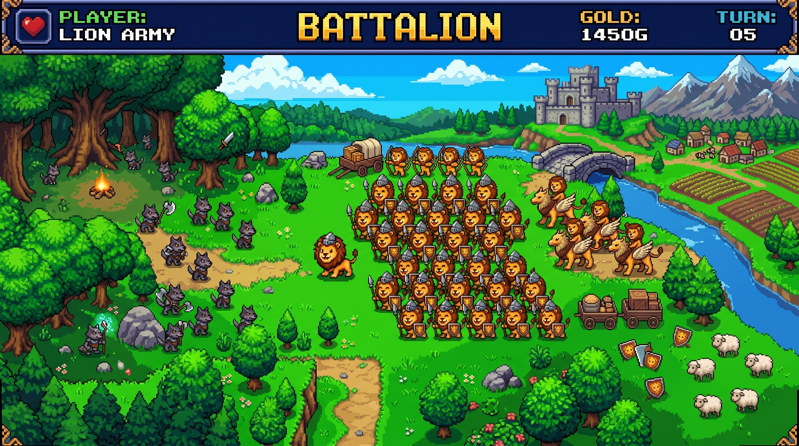

<div align="center">
  
</div>

# Battalion Status

## Snapshot

- App: `Battalion`
- Version: `1.0.0`
- Repo path:
  - `C:\Users\wmjef\Desktop\Precious Box\Dotcoms\jeffersonwm\apps\battalion`
- Live runtime path:
  - `E:\battalion`
- Production frontend:
  - `https://jeffersonwm.com/battalion/`
- Dev frontend:
  - `http://localhost:5173`
- Backend port:
  - `8070`
- Tunnel token:
  - `C:\Users\Bill\.cloudflared\tokens\api-battalion.token`

## Current Release Profile

Battalion is now imported into the JeffersonWM monorepo as a real tracked app instead of a placeholder reference. The imported copy includes:

- `backend`
- `client`
- `emotions`
- `other`
- package metadata and lockfile

Excluded from import on purpose:

- `node_modules`
- built frontend output from `client/dist`
- `.env`
- local backend data folders

## What Changed In 1.0.0

- Consolidated the old Reports and Data Editor entry points into a unified tabbed `Settings Hub`.
- Added an `Emotions` data editor with sort, search, add, edit, delete, and JSON or CSV import/export.
- Expanded the mood model from 5 to 10 levels, including updated emoji display, tooltips, and XP multipliers.
- Standardized the `unpleasant` mood emoji to `😒` for more reliable cross-browser rendering.
- Turned Feelings and Actions sections into expanded-by-default accordions with rotating chevrons.
- Added live search filtering inside the Feelings and Actions accordions without dropping input focus.
- Added browser-based reminder scheduling with interval mode or explicit daily time lists.
- Improved quest card spacing and styling with cleaner gaps, padding, and shadow treatment.
- Tightened mobile layout behavior for small screens to reduce overlap and truncation.

## Runtime Commands

### Local development

```powershell
Set-Location C:\Users\wmjef\Desktop\Precious Box\Dotcoms\jeffersonwm\apps\battalion
npm run dev
```

### Local backend only

```powershell
Set-Location C:\Users\wmjef\Desktop\Precious Box\Dotcoms\jeffersonwm\apps\battalion
npm run server
```

### Home server production runtime

```powershell
Set-Location E:\battalion
npm run prod
```

### Tunnel

```powershell
cloudflared.exe tunnel run --token-file C:\Users\Bill\.cloudflared\tokens\api-battalion.token
```

## Frontend Build

```powershell
Set-Location C:\Users\wmjef\Desktop\Precious Box\Dotcoms\jeffersonwm\apps\battalion
npm run build
```

Vite is configured with a production base path of:

- `/battalion/`

That means the built frontend output from:

- `client/dist`

should be uploaded into the live Battalion subfolder on the JeffersonWM site.

## Data And Database Changes

### `jeffers4_battact`

- `player.notifications_enabled TINYINT(1) DEFAULT 0`
- `player.notification_interval VARCHAR(20) DEFAULT '2h'`
- `player.notification_time VARCHAR(50) DEFAULT '09:00'`
- `mood_log.mood` changed from `ENUM` to `VARCHAR(50)`

### `jeffers4_battemo`

- API support added for:
  - `POST`
  - `PUT`
  - `DELETE`
  on the `emotions` table

## Known Install Blocker On This Laptop

`npm install` currently stops on:

- `better-sqlite3`

Reason:

- this machine is missing the Windows C++/SDK toolchain needed for native addon builds under the current Node setup

This is an environment/tooling issue, not a Battalion source issue.

## What Needs To Happen Next

1. Install the Windows native build prerequisites or switch Battalion installs to a Node version with matching prebuilt binaries.
2. Re-run:

```powershell
Set-Location C:\Users\wmjef\Desktop\Precious Box\Dotcoms\jeffersonwm\apps\battalion
npm install
npm run build
```

3. Stage and commit the Battalion import with the accompanying JeffersonWM docs updates.
4. After commit, publish the `1.0.0` release entry into Feed using:
   - `apps/feed/release-seeds/2026-05-27-battalion-1.0.0.json`

## Feed / Release Seed

Prepared release seed:

- `C:\Users\wmjef\Desktop\Precious Box\Dotcoms\jeffersonwm\apps\feed\release-seeds\2026-05-27-battalion-1.0.0.json`

This is ready to publish once the repo changes are committed.
