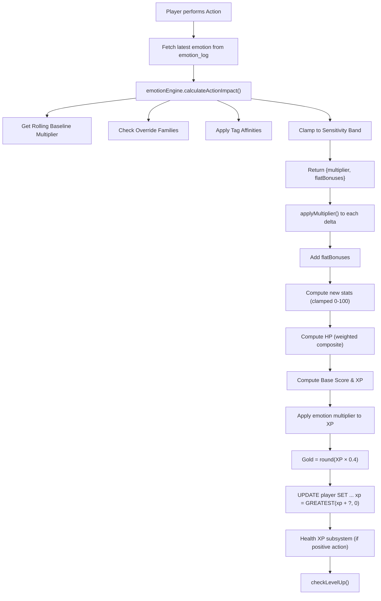

# Battalion — Complete Game Mechanics Reference

> All formulas, constants, variables, and contextual rules extracted from the live codebase as of August 2026.

---

## 1. Core Variables (Player State)

| Variable | Type | Range | Default | Description |
|---|---|---|---|---|
| `level` | int | 1 … ∞ | 1 | Player progression level |
| `xp` | int | 0 … `xp_to_next` | 0 | Current XP within level (floor-clamped at 0) |
| `xp_to_next` | int | computed | 500 | XP needed to reach next level |
| `hp` | int | 0 … `max_hp` | 100 | Hit points (weighted composite) |
| `max_hp` | int | 100 … ∞ | 100 | Max HP (grows via Health Level) |
| `gold` | int | 0 … ∞ | 50 | Currency (floor-clamped at 0) |
| `stat_energy` | int | 0 … 100 | 50 | Energy stat |
| `stat_stress` | int | 0 … 100 | 30 | Stress stat (higher = worse) |
| `stat_money` | int | -∞ … ∞ | 100 | Money stat (unclamped) |
| `stat_social` | int | 0 … 100 | 20 | Social stat |
| `stat_health` | int | 0 … 100 | 50 | Health stat |
| `stat_hygiene` | int | 0 … 100 | 50 | Hygiene stat |
| `stat_fun` | int | 0 … 100 | 20 | Fun stat |
| `stat_discipline` | int | 0 … 100 | 20 | Discipline stat |
| `health_level` | int | 1 … ∞ | 1 | Health subsystem level |
| `health_xp` | int | 0 … ∞ | 0 | Health XP within health level |
| `health_xp_to_next` | int | computed | 100 | Health XP needed for next health level |
| `title` | string | — | "Recruit" | Title derived from level |
| `current_mood` | enum | see §7 | "neutral" | Current mood state |
| `mood_modifier` | decimal | 0.6 … 1.4 | 1.00 | XP multiplier from mood |

---

## 2. Action Processing Pipeline

Every action follows this exact sequence:

---

## 3. Emotion Engine

### 3.1 Rolling Baseline Multiplier

$$M_{\text{base}} = \text{clamp}\left(1.00 + \frac{\sum_{i=1}^{n} \delta_i}{n},\ 0.80,\ 1.20\right)$$

Where $n = \min(5, |\text{emotion\_logs}|)$ and for each log entry:

$$\delta_i = \begin{cases} +(\text{tier}_i \times 0.02) & \text{if category} \in \{\text{aliveness\_joy, courageous\_powerful, hopeful, grateful, connected\_loving}\} \\ -(\text{tier}_i \times 0.02) & \text{if category} \in \{\text{angry\_annoyed, fear, despair\_sad, powerless, stressed\_tense}\} \\ 0 & \text{otherwise (neutral categories)} \end{cases}$$

| Constant | Value | Description |
|---|---|---|
| Window size | 5 | Last 5 emotion log entries |
| Per-tier step | ±0.02 | Modification per tier per entry |
| Floor | 0.80 | Minimum baseline multiplier |
| Ceiling | 1.20 | Maximum baseline multiplier |

### 3.2 Tag Affinity Adjustment

Each emotion category has `favored_tags` and `avoided_tags`. If the action's `emotion_tags` overlap:

$$\text{tierPressure} = \text{tier} \times 0.03$$

$$M = \begin{cases} M + \text{tierPressure} & \text{if action tags} \cap \text{favored\_tags} \neq \emptyset \\ M - \text{tierPressure} & \text{if action tags} \cap \text{avoided\_tags} \neq \emptyset \\ M & \text{otherwise} \end{cases}$$

| Constant | Value |
|---|---|
| Per-tier affinity step | 0.03 |
| Default tier (if null) | 3 |

### 3.3 Sensitivity Band Clamping

$$M_{\text{final}} = \text{clamp}(M,\ M_{\min},\ M_{\max})$$

| Sensitivity | Default Band | $M_{\min}$ | $M_{\max}$ |
|---|---|---|---|
| Low | `0.90–1.10` | 0.90 | 1.10 |
| Medium (default) | `0.85–1.20` | 0.85 | 1.20 |
| High | `0.80–1.30` | 0.80 | 1.30 |

If an **override** is active, its `multiplier_floor` and `multiplier_ceiling` replace the band.

### 3.4 Override Families

| Override | Applies to Tags | Applies to Emotions | Rule |
|---|---|---|---|
| `high_intensity_risky_actions` | risky, conflict, escape | Fear, Angry/Annoyed, Stressed/Tense, Powerless | `tier ≥ 4`: floor=0.72, ceil=1.32, stress+2, social−1, time×1.08 |
| `social_restoration_actions` | social, restorative, care, comfort | Connected/Loving, Tender, Grateful, Accepting/Open, Hopeful | `tier ≥ 3`: floor=0.88, ceil=1.24, social+2, stress−1, health+1, fun+1 |

---

## 4. Delta Application

### 4.1 The `applyMultiplier` Function

For each stat delta $d$ with emotion multiplier $M$:

$$\text{final}(d, M) = \begin{cases} \text{round}(d \times M) & \text{if } d > 0 \\ \text{round}\left(d \times \text{clamp}(2.0 - M,\ 0.5,\ 1.3)\right) & \text{if } d < 0 \\ 0 & \text{if } d = 0 \end{cases}$$

**Behavior summary:**

| Scenario | $M$ | Positive $d$ | Negative $d$ |
|---|---|---|---|
| Positive emotion | 1.10 | $d × 1.10$ (boosted) | $d × 0.90$ (softened) |
| Neutral emotion | 1.00 | $d × 1.00$ (unchanged) | $d × 1.00$ (unchanged) |
| Negative emotion | 0.85 | $d × 0.85$ (reduced) | $d × 1.15$ (amplified) |

The negative-delta factor is clamped: $f = \text{clamp}(2.0 - M,\ 0.5,\ 1.3)$

### 4.2 Final Stat Computation

$$\text{stat}_{\text{new}} = \text{clamp}\left(\text{stat}_{\text{old}} + \text{final}(d, M) + \text{flatBonus},\ 0,\ 100\right)$$

Exception: `stat_money` is **unclamped** (can go negative or above 100).

---

## 5. HP System (Weighted Composite)

$$HP_{\text{computed}} = \text{round}\left( \begin{aligned} &0.25 \times \text{health} \\ +\ &0.20 \times \text{energy} \\ +\ &0.15 \times \text{hygiene} \\ +\ &0.15 \times \text{fun} \\ +\ &0.10 \times \text{discipline} \\ +\ &0.10 \times \text{social} \\ +\ &0.05 \times (100 - \text{stress}) \end{aligned} \right)$$

| Stat | Weight | Notes |
|---|---|---|
| Health | 25% | Largest contributor |
| Energy | 20% | Second largest |
| Hygiene | 15% | — |
| Fun | 15% | — |
| Discipline | 10% | — |
| Social | 10% | — |
| Inverted Stress | 5% | $(100 - \text{stress})$; high stress → low HP |

**Positive action bonus:** If base score > 0, HP gets a floor of `old_hp + 2`:
$$HP_{\text{final}} = \text{clamp}\left(\max(HP_{\text{computed}},\ HP_{\text{old}} + 2),\ 0,\ \text{max\_hp}\right)$$

---

## 6. XP / Leveling System

### 6.1 Base Score (Net Action Value)

$$S = d_{\text{energy}} - d_{\text{stress}} + d_{\text{social}} + d_{\text{health}} + d_{\text{hygiene}} + d_{\text{fun}} + d_{\text{discipline}}$$

> [!IMPORTANT]
> Stress is **subtracted** because positive stress delta is bad for the player.

### 6.2 Raw XP Calculation

$$XP_{\text{raw}} = \begin{cases} \max\left(5,\ S \times 2 + \lfloor\frac{t}{2}\rfloor\right) & \text{if } S \geq 0 \quad \text{(positive action)} \\ 0 & \text{if } S < 0 \quad \text{(negative action — no XP loss)} \end{cases}$$

Where $t$ = `time_minutes` of the action.

### 6.3 Final XP

$$XP_{\text{earned}} = \text{applyMultiplier}(XP_{\text{raw}}, M)$$

$$\text{Gold}_{\text{earned}} = \text{round}(XP_{\text{earned}} \times 0.4)$$

$$XP_{\text{new}} = \max(XP_{\text{old}} + XP_{\text{earned}},\ 0) \qquad \text{(floor-clamped at 0)}$$

### 6.4 Level-Up Curve

$$XP_{\text{to\_next}}(L) = \lfloor 500 \times L^{1.8} \rfloor$$

| Level | XP Required | Cumulative |
|---|---|---|
| 1 → 2 | 500 | 500 |
| 2 → 3 | 1,741 | 2,241 |
| 3 → 4 | 3,569 | 5,810 |
| 4 → 5 | 5,946 | 11,756 |
| 5 → 6 | 8,839 | 20,595 |
| 10 → 11 | 31,548 | ~131K |
| 15 → 16 | 66,874 | ~452K |
| 20 → 21 | 114,475 | ~1.05M |
| 25 → 26 | 174,110 | ~2.09M |
| 30 → 31 | 245,580 | ~3.64M |

### 6.5 Title Progression

| Level Range | Title |
|---|---|
| 1 – 4 | Recruit |
| 5 – 9 | Soldier |
| 10 – 14 | Veteran |
| 15 – 19 | Captain |
| 20 – 24 | Commander |
| 25 – 29 | Hero |
| 30+ | Legend |

---

## 7. Health XP Subsystem

Triggered only when `baseScore > 0` AND the action is health-related:

$$\text{healthXP} = \max\left(5,\ \max(0, d_{\text{health}}^{\text{final}}) \times 5 + \max(0, d_{\text{energy}}^{\text{final}}) \times 2 + \max(0, d_{\text{hygiene}}^{\text{final}}) \times 2\right)$$

**Health Level-Up Curve:**

$$\text{health\_xp\_to\_next}(L_h) = \lfloor 100 \times L_h^{1.5} \rfloor$$

**On Health Level-Up:**
- $\text{max\_hp} \mathrel{+}= 10$
- $\text{hp} = \text{max\_hp}$ (full heal)

Qualifies if: `category ∈ {basic_needs, food_cooking, health_fitness}` OR `health_delta > 0` OR `energy_delta > 0` OR `hygiene_delta > 0`.

---

## 8. Mood Modifier Table

$$XP_{\text{mood}} = XP_{\text{base}} \times M_{\text{mood}} \times (1 + \text{streak} \times 0.1)$$

| Mood | Modifier |
|---|---|
| Terrible | 0.60 |
| Miserable | 0.70 |
| Bad | 0.80 |
| Unpleasant | 0.90 |
| Okay | 1.00 |
| Fine | 1.05 |
| Good | 1.10 |
| Great | 1.20 |
| Excellent | 1.30 |
| Fantastic | 1.40 |

---

## 9. Difficulty Multipliers (Tasks)

| Difficulty | XP × | Gold × | Stat × | HP Penalty |
|---|---|---|---|---|
| Easy | 1.0 | 1.0 | 1.0 | 2 |
| Medium | 2.5 | 2.0 | 2.0 | 5 |
| Hard | 5.0 | 5.0 | 3.0 | 10 |
| Epic | 10.0 | 10.0 | 5.0 | 20 |

---

## 10. Emotion Tier Tuning Table

| Tier | XP Mult | HP Mult | Stress Mult | Direct Loss? |
|---|---|---|---|---|
| Neutral | 1.00 | 1.00 | 1.00 | No |
| Mild Positive | 1.03 | 1.02 | 0.97 | No |
| Strong Positive | 1.08 | 1.06 | 0.92 | No |
| Mild Negative | 0.96 | 0.97 | 1.04 | No |
| Strong Negative | 0.90 | 0.92 | 1.10 | Yes |
| Extreme Negative | 0.82 | 0.86 | 1.18 | Yes |

---

## 11. Achievements

| Key | Condition | Name |
|---|---|---|
| `first_task` | tasks_completed ≥ 1 | First Step |
| `ten_tasks` | tasks_completed ≥ 10 | Getting Going |
| `fifty_tasks` | tasks_completed ≥ 50 | Dedicated |
| `hundred_tasks` | tasks_completed ≥ 100 | Centurion |
| `level_5` | level ≥ 5 | Rising Star |
| `level_10` | level ≥ 10 | Veteran |
| `level_25` | level ≥ 25 | Elite |
| `rich` | gold ≥ 1000 | Wealthy |
| `healthy` | stat_health ≥ 50 | Peak Performance |

---

## 12. Emotion Categories (18 Total)

### Positive Categories (boost multiplier)
`aliveness_joy` · `courageous_powerful` · `hopeful` · `grateful` · `connected_loving` · `accepting_open` · `curious` · `tender`

### Negative Categories (reduce multiplier)
`angry_annoyed` · `fear` · `despair_sad` · `powerless` · `stressed_tense` · `guilt` · `fragile` · `disconnected_numb` · `embarrassed_shame` · `unsettled_doubt`

Each category has: `favored_tags`, `avoided_tags`, `supported_motives`, `opposed_motives`, 8 flat stat modifiers, 8 delta multipliers, and a `time_minutes_mult`.

---

## 13. Action Tag Taxonomy

Tags assigned to each action for emotion affinity matching:

`routine` · `restorative` · `social` · `care` · `comfort` · `creative` · `learning` · `stimulation` · `achievement` · `discipline_building` · `identity` · `escape` · `risky` · `conflict`

---

## 14. Stat Range Summary

| Element | Min | Max | Notes |
|---|---|---|---|
| Action deltas | -100 | +100 | Scaled 10× from original ±10 |
| Category stats | 0 | 100 | Clamped (except money) |
| HP | 0 | max_hp | Weighted composite |
| XP (in-level) | 0 | xp_to_next | Floor-clamped, no negatives |
| Gold | 0 | ∞ | Floor-clamped at 0 |
| Emotion multiplier | 0.72 | 1.32 | Depends on band + overrides |
| Baseline multiplier | 0.80 | 1.20 | Rolling 5-entry average |
