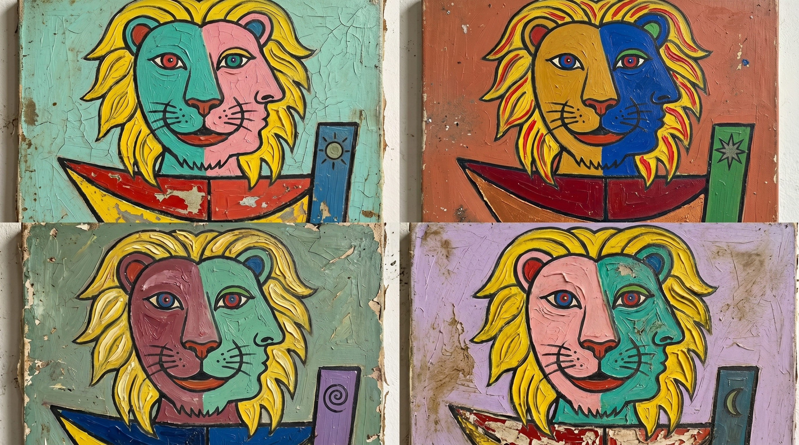

<div align="center">
  
</div>

# Lionship

Lionship is a compact link index with optional shared persistence. It lives inside the JeffersonWM repo, but it now follows the same runtime pattern as the other apps:

- local source repo for editing
- static frontend build for hosting
- optional Node API for shared storage
- optional MySQL backend for persistence across devices

## Runtime Model

Lionship has two practical modes.

### Local or static-only mode

In this mode:

- the built frontend is hosted statically
- the browser falls back to local storage
- no Node process or database is required

This is the lowest-friction mode if you only need the current device to remember link edits.

### Backend-backed mode

In this mode:

- `server.ts` runs a Node/Express API
- the app reads and writes through `/api/links`
- MySQL stores the shared link data

This is the right mode if you want the same link set to be editable across devices.

## Local Development

From the app folder:

```powershell
cd apps/lionship
npm install
npm run dev
```

That starts the integrated app server on:

- `http://localhost:8040`

If you want to run only the frontend Vite client separately, use:

```powershell
npm run dev:client
```

That serves the frontend on:

- `http://localhost:8041`

## Environment Variables

Copy `.env.example` to a local env file and set only what you need.

```text
GEMINI_API_KEY=
VITE_API_BASE_URL=
PORT=8040
HOST=0.0.0.0
PUBLIC_BASE_URL=http://localhost:8040
ALLOWED_ORIGINS=http://localhost:8040,http://localhost:8041
MYSQL_HOST=
MYSQL_USER=
MYSQL_PASSWORD=
MYSQL_DATABASE=
```

### Notes

- Leave `VITE_API_BASE_URL` blank if the frontend and API share the same origin.
- Set `VITE_API_BASE_URL` if the frontend is hosted separately from the API.
- If `MYSQL_*` values are missing, the UI falls back to local storage.

## Build and Deploy

Build the frontend with:

```powershell
npm run build
```

Output:

- `apps/lionship/dist`

Current hosted frontend path:

- `https://jeffersonwm.com/lionship/`

Chosen production API hostname:

- `https://api-lionship.jeffersonwm.com`

## Suggested Production Shape

The clean long-term pattern is:

- frontend hosted statically
- Node API running on the home server
- Lionship API port standardized to `8040`
- API hostname: `https://api-lionship.jeffersonwm.com`
- MySQL used for shared persistence

That keeps Lionship aligned with Perihelion, Dooky, and Jeffershizzle while still letting it degrade gracefully if the database is unavailable.
