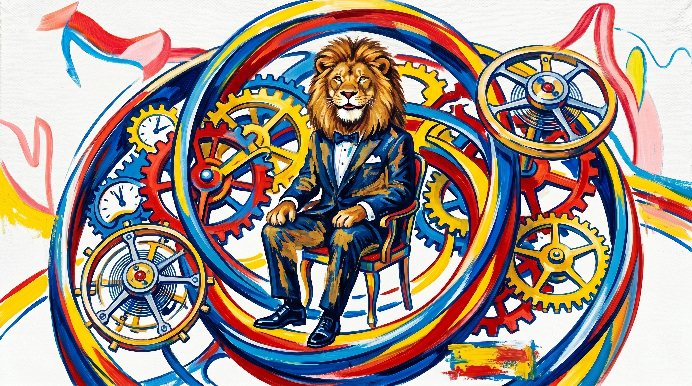

  

## Tourbillion

Tourbillion is a standalone browser screensaver app inside the JeffersonWM app family.

It currently includes these animation modes:
- Starfield
- Matrix
- Mystify
- Pipes
- Toasters
- Trains

## Local development

1. Install dependencies:
   `npm install`
2. Start the dev server:
   `npm run dev`
3. Open:
   `http://localhost:3060/tourbillion/`

## Build

Create a static production build with:

`npm run build`

The build output lands in `dist/` and is intended to be deployed at:

`https://jeffersonwm.com/tourbillion/`
